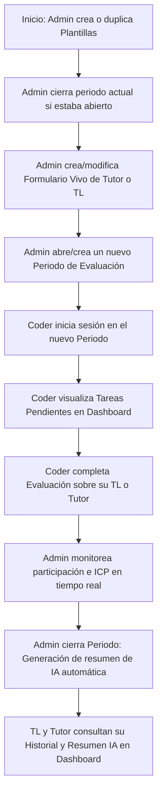

# 🔄 Flujos y Casos de Uso (Riwi LeadTrace)

Este documento detalla la secuencia lógica de navegación y operación de la plataforma, dividida por roles de usuario, junto con los caminos exitosos (*caminos felices*) y los casos de error/límites (*caminos tristes*) controlados por la aplicación y la base de datos.

---

## 🗺️ 1. Flujo General de Uso

El ciclo de vida de las evaluaciones sigue la siguiente topología de estados coordinada por el **Admin** y completada por los **Coders**:

---

## 👥 2. Casos de Uso por Rol

### 👔 A. Casos de Uso del Administrador (Admin)

El administrador gestiona los instrumentos de evaluación (formularios), la temporalidad (periodos), la configuración global de la plataforma, y audita las métricas globales.

| ID | Acción / Caso de Uso | Camino Feliz (Bueno) | Camino de Error / Restricciones (Malo) |
|---|---|---|---|
| **ADM-01** | **Cerrar Periodo Activo** | Se cierra el periodo; las evaluaciones en borrador se congelan y la IA empieza a generar resúmenes en segundo plano de forma segura. | No se puede cerrar si no hay ningún periodo activo (la interfaz oculta la opción). |
| **ADM-02** | **Crear Formulario Vivo** | El Admin crea un formulario para Tutor o TL. Si ya existía uno para ese rol, el anterior pasa automáticamente a `is_active = FALSE` y el nuevo queda activo. | **Rechazo (409)**: No se puede crear ni activar un formulario si hay un periodo de evaluación abierto (para no corromper datos en curso). |
| **ADM-03** | **Validación de Pesos** | Las preguntas tipo `scale` de un formulario deben sumar exactamente 100%. | **Rechazo (422)**: Si la suma de pesos no da 100% (dentro de la tolerancia configurada de e.g. 0.01), el formulario se rechaza con alerta visual en pantalla. |
| **ADM-04** | **Eliminar Formulario** | Si el formulario nunca ha recibido respuestas, se elimina físicamente de la base de datos de manera definitiva. | **Archivado Seguro**: Si el formulario ya tiene evaluaciones registradas, MySQL bloquea la eliminación física y el sistema automáticamente lo marca como **Archivado** (`archived_at`), saliendo de la vista del Admin pero preservando el historial del Coder. |
| **ADM-05** | **Configurar Umbrales** | Se definen umbrales de ICP para clasificaciones (*En Riesgo*, *Excelente*) y mínimo de evaluaciones necesarias para mostrar gráficos. | **Rechazo (Pydantic / UI)**: No se puede guardar si el umbral de riesgo es mayor o igual al excelente, o si el mínimo de respuestas es inferior a 1. |

---

### 💻 B. Casos de Uso del Coder (Evaluador)

El Coder es el encargado de proveer el feedback cuantitativo y cualitativo sobre sus líderes asignados.

| ID | Acción / Caso de Uso | Camino Feliz (Bueno) | Camino de Error / Restricciones (Malo) |
|---|---|---|---|
| **CDR-01** | **Visualizar Pendientes** | El Coder ve en su Dashboard cuántas personas de su clan le falta evaluar en el periodo activo. | Si no hay periodo activo, el Dashboard indica que la plataforma se encuentra fuera de ciclos de evaluación. |
| **CDR-02** | **Enviar Evaluación (Firma)** | El Coder completa la encuesta y la envía. Se registra su participación de forma inmutable. | **Rechazo por Duplicado (409)**: Si el Coder intenta enviar dos evaluaciones para el mismo líder en el mismo periodo, el índice único `uq_submission_once` de la base de datos bloquea el intento. |
| **CDR-03** | **Evaluación Anónima** | El Coder marca la casilla *"Evaluar de forma anónima"*. Sus respuestas y comentarios se desvinculan visualmente de su nombre en los reportes del TL. | **Preservación del Historial**: El Coder conserva el derecho a leer sus propias evaluaciones enviadas en su pestaña *"Mis Evaluaciones"* (el backend valida de forma segura si el email del Coder coincide para revelarlas sólo a él). |
| **CDR-04** | **Borradores de Respuestas** | El Coder puede salir a mitad de la encuesta y sus respuestas parciales se guardan localmente en borrador. | Si el Administrador cierra el periodo de evaluación, el borrador queda inhabilitado para envío. |

---

### 🎓 C. Casos de Uso de Team Leaders y Tutores (Evaluados)

Los evaluados reciben feedback y promedios para incentivar la mejora continua.

| ID | Acción / Caso de Uso | Camino Feliz (Bueno) | Camino de Error / Restricciones (Malo) |
|---|---|---|---|
| **TL-01** | **Consultar ICP de Periodo** | El TL/Tutor ve su promedio ponderado de ICP y la clasificación de desempeño (*Estable*, *Sólido*, *En Riesgo*) en base a los umbrales configurados. | **Ocultación por Datos Insuficientes**: Si el número de evaluaciones recibidas es menor al configurado en settings (ej. menos de 3), los números e histogramas no se muestran en pantalla para proteger la confidencialidad de la muestra. |
| **TL-02** | **Consultar Resumen IA** | La pestaña *"Resumen IA"* muestra el resumen de fortalezas y debilidades redactado de forma objetiva por Gemini. | Si el periodo está activo, el resumen no se puede generar para evitar sesgos dinámicos durante el transcurso de las votaciones. |
| **TL-03** | **Ver Comentarios** | El TL/Tutor ve el listado de comentarios adicionales cualitativos de su equipo. | **Anonimización Estricta**: Los comentarios que se marcaron como anónimos se muestran bajo el nombre "Anónimo" y las vistas SQL garantizan que el ID del evaluador sea omitido del payload devuelto. |
